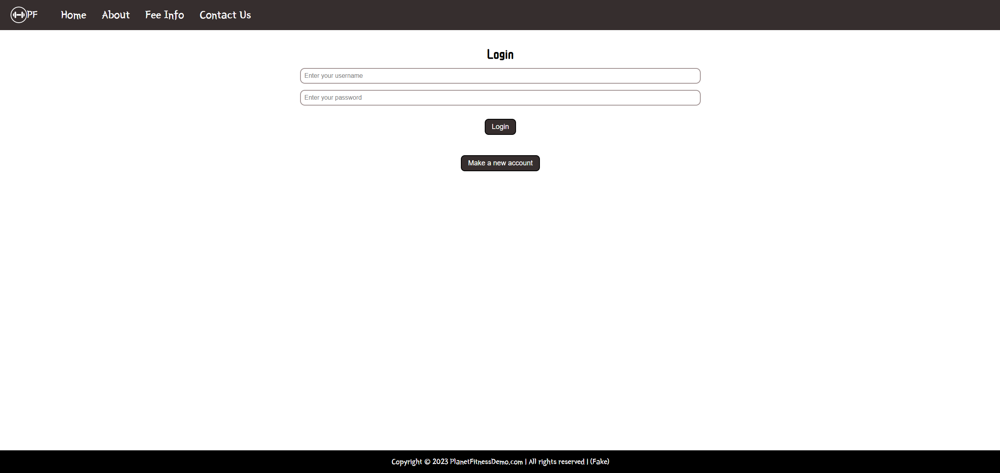
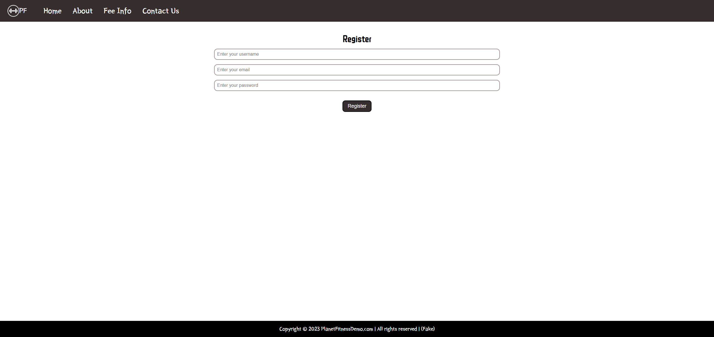

# Gym-website
 Gym website demo featuring a fundamental homepage with its services, login and registration page, accompanied by a dedicated tab for the Contact Us form. The underlying technology stack comprises Node.js, Express.js, and MongoDB, serving as the backbone for storing the customer information and the data submitted by customers through the Contact Us form.

## Technologies Used

- HTML, CSS, Javascript
- Node - Mongoose, Pug, Express
- MongoDB to securely store the data provided through the portal

## Screenshots

### Login

### SignUp

### Home

### ContactUs

